# Consultant Workspace

**One workspace for an independent consultant: bookings, meetings and emails turned into tasks, a task board, a weekly timeline and alerts.**

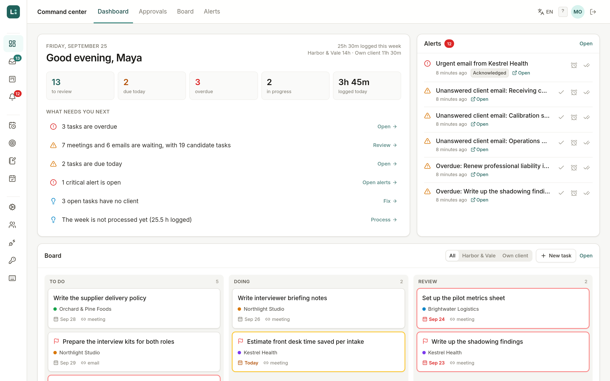

## In plain words

Maya is a consultant. Part of her week she works for a bigger consulting firm that subcontracts her, and part of it for her own clients. Every meeting ends with notes, every day brings emails, and somewhere in all that text are the things she promised to do. This app reads the notes and the emails, writes a short summary of each, and suggests the tasks it found. Maya says yes or no to each suggestion, and only the yes ones land on her task board. At the end of the week she drags her work into a calendar-like grid, and one click copies that week into her calendar so her hours are on record. When something slips (an email nobody answered, a task that went overdue, a background job that stopped), she gets an alert.

Everything you see here is invented: Maya, her practice (Lumen Advisory), the partner firm (Harbor & Vale Consulting), the four clients and every email address.

## Why I built it

I built the first version of this for a consultant who was drowning. Her meeting notes lived in one tool, her emails in two inboxes, her tasks in her head, and her timesheet was rebuilt from memory every Friday night. The hardest part was that her work had two sides: hours for the partner firm are billed through their timesheet, hours for her own clients are invoiced by her, and one task filed on the wrong side meant a wrong invoice.

Two things mattered more than any feature. First, nothing should reach her board without her saying so, because a board full of half-right tasks generated by a machine is worse than no board. Second, the automation had to be honest about its own health: a nightly job that quietly stops is how you find out three weeks later that no emails were read.

This repository is a clean rebuild of that tool, reconstructed from the problems it solved, with a fictional brand and invented data.

## What you can do

- **Review meetings and emails.** Each one is summarized into topics, key decisions and candidate tasks. Every task needs Approve or No action, and a meeting can only be marked Done once all of its tasks are classified. Decisions can be undone, and a Reviewed tab keeps the history with Approved and No action tags.
- **Trust the client and the side.** The app works out the client and whether it is partner firm work or an own client from the sender domain, the participants and the content, and shows why it decided. Fixed rules (a client who writes from a personal address) always win. Editing the client of a meeting updates its pending tasks too.
- **Run the board.** A kanban with drag and drop, client and side on every card, a side filter, red borders for overdue and yellow for due today, per-column sorting, an Active projects overlay, and filters that follow you to another device. Changes made by anyone (another admin, an approval, an API token) appear live.
- **Hand the board to someone else.** Create API tokens with a role (viewer, contributor, manager or custom permissions). A built-in docs page has curl and JavaScript examples and a block of instructions to paste into another tool.
- **Plan and record the week.** Drag tasks from a backlog into a week grid, edit a block's duration with a live preview of when it ends, view the week per side, "Process my week" into a report (merging back-to-back blocks, flagging blocks without a client or overlapping), and sync the week to a calendar as busy events in one click. The timeline is shared by every admin and updates in real time.
- **Keep goals.** Objectives with key results; a key result can repeat (every Friday, every weekday) and each occurrence becomes a checkbox. List and kanban views, and completed items grouped by day.
- **Write notes.** Nested folders you can rearrange by dragging, a rich text editor, and a sync that copies notes from a mail folder without ever deleting one.
- **Stay alerted.** An alert center with editable rules (for example: an own-client email thread unanswered for more than 24 hours), quick actions (acknowledge, snooze, resolve, undo), delivery through an outbox with email and WhatsApp relays, and a jobs panel where every scheduled job shows its heartbeat and who is watching it.
- **Take bookings.** A public page where people book a call; each service books into its own calendar, and that calendar's busy time is removed from the free slots.
- **Connect accounts.** OAuth refresh tokens are encrypted with AES-256-GCM before they are stored, can be refreshed and re-encrypted under a new key, and the integrations page streams in each provider's status as it arrives.
- Everything in English or Portuguese, with configurable keyboard shortcuts (press `?`).

## Screenshots

| | |
|---|---|
| 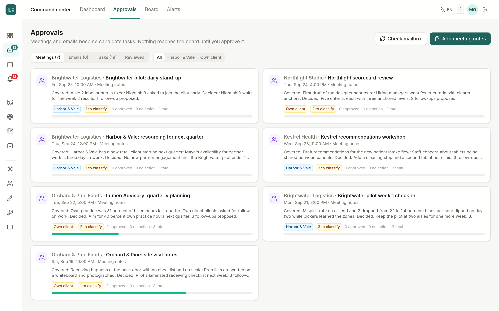 Approval queue | 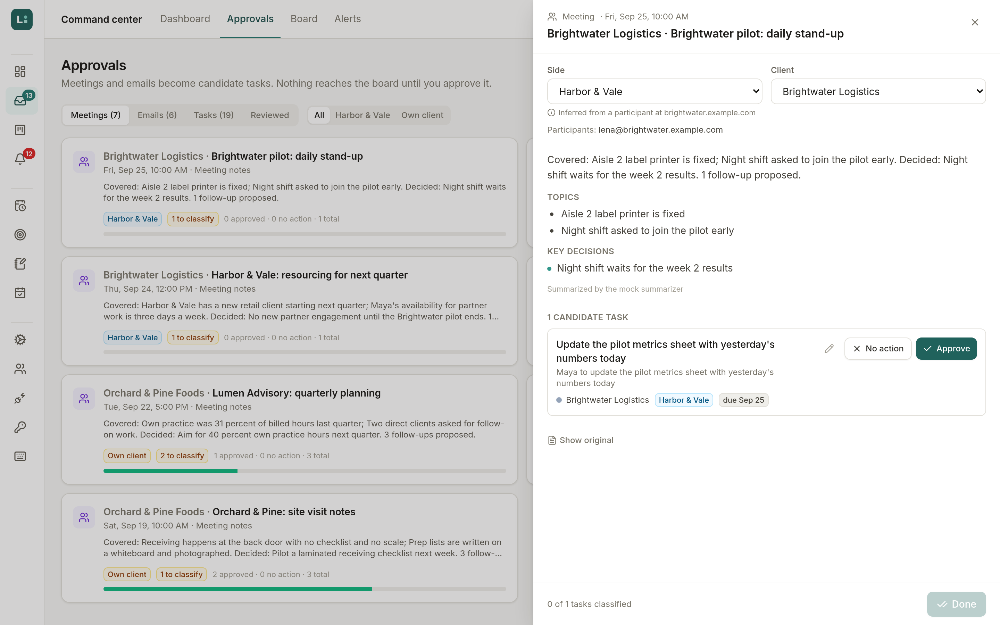 One meeting, its summary and candidate tasks |
| 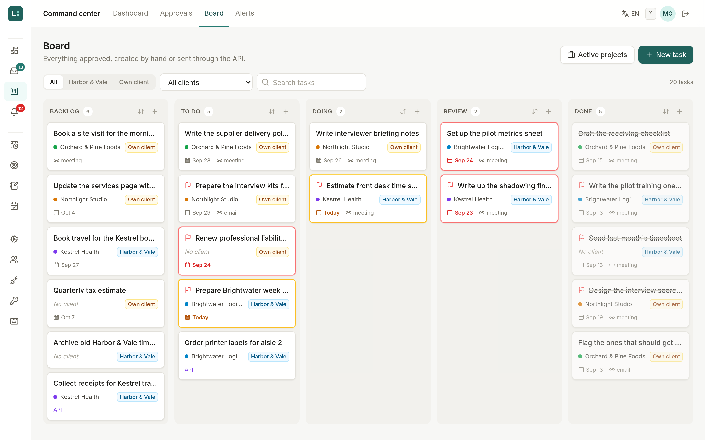 Board with side tags and deadline borders | 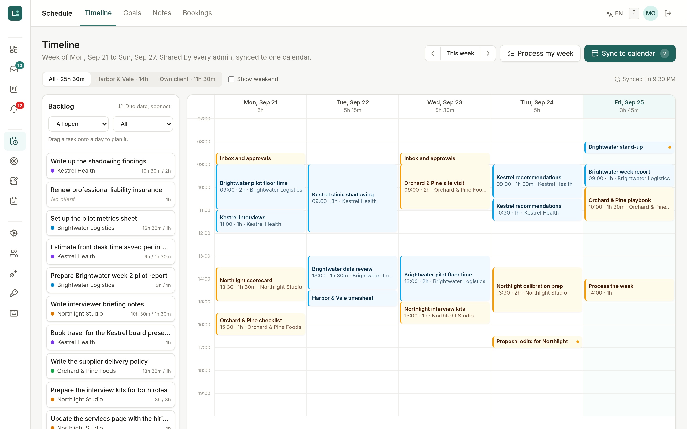 Weekly timeline with the backlog |
| 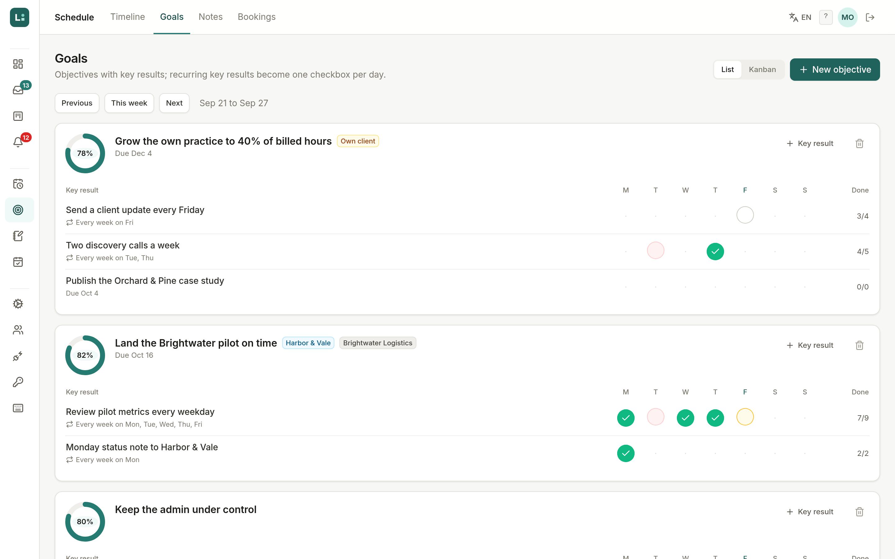 Goals with recurring key results | 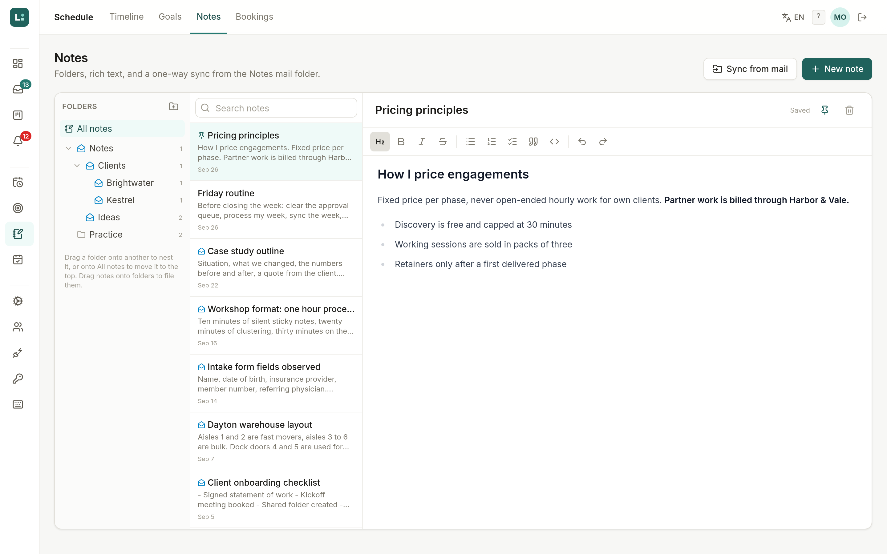 Notes |
| 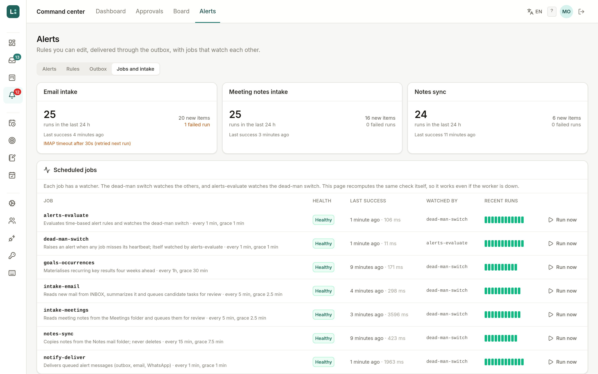 Jobs and intake health | 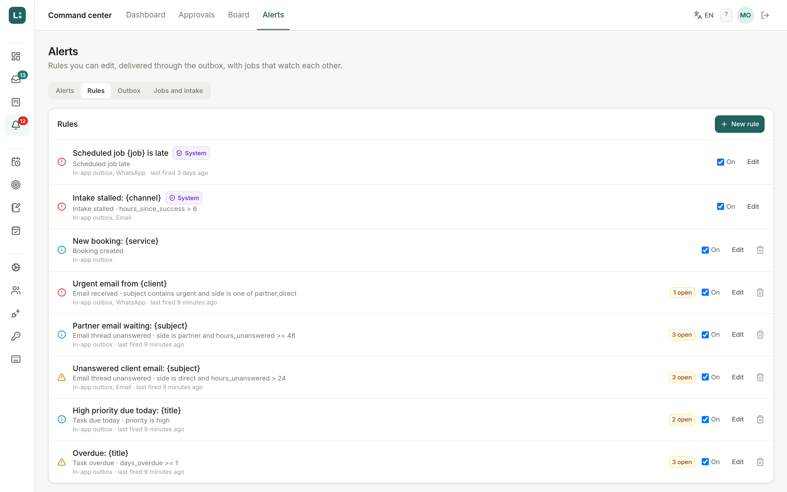 Alert rules |
| 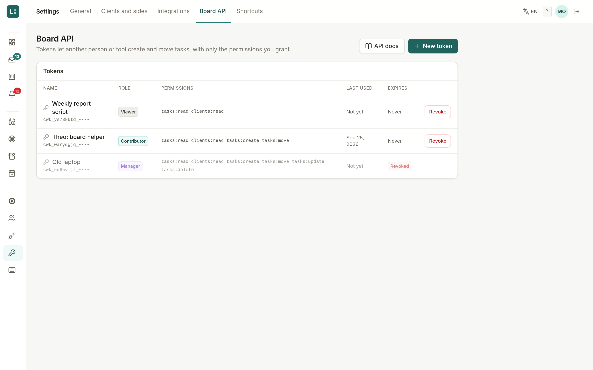 Board API tokens | 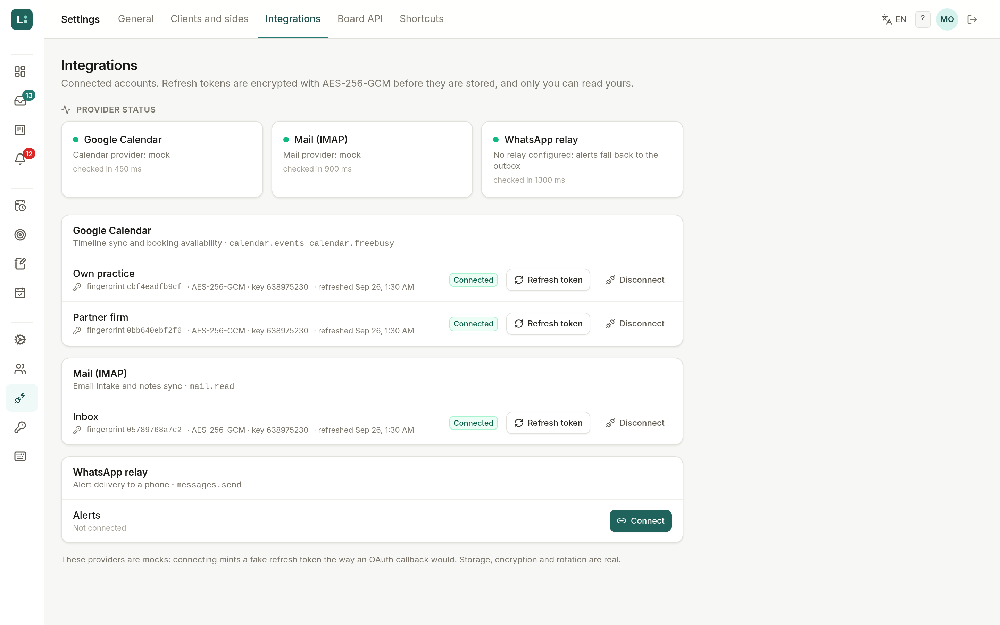 Integrations |
| 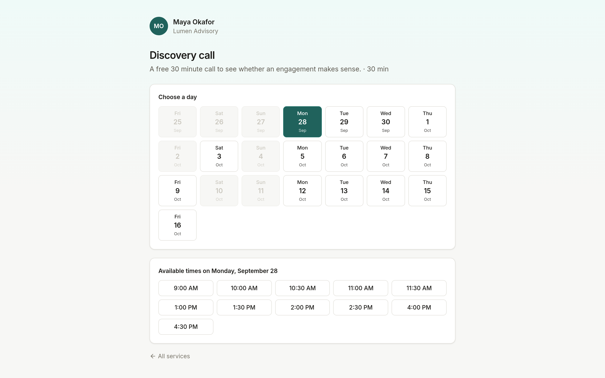 Public booking page | |

## How to run it

### With Docker (one command)

```bash
docker compose up --build
```

Then open http://localhost:3000 and sign in as `maya@lumen.example.com` with the password `workspace-demo`.

That one command starts four things from one image: Postgres, a one-shot job that runs the migrations and seeds a month of invented data (only when the database is empty), the web app, and the cron worker. Ports and the project name can be changed with `WEB_PORT`, `DB_PORT` and `docker compose -p <name>`.

### For development

You need Node 22 and a Postgres 16.

```bash
cp .env.example .env            # works as is for local development
docker compose up -d db         # or point DATABASE_URL at your own Postgres
npm install
npm run db:migrate              # creates the tables and the app's database role
npm run db:seed                 # the invented month; safe to run again, it starts over
npm run dev                     # http://localhost:3000
npm run worker                  # in a second terminal: the scheduled jobs
```

### Tests

```bash
npm run typecheck && npm run lint
npm test                        # unit tests (vitest)
npx playwright install chromium     # once: the browser the end-to-end tests drive
npm run db:seed                     # the end-to-end tests expect a freshly seeded database
npm run build && npm run test:e2e   # end-to-end (Playwright)
```

The end-to-end suite covers the three flows that matter most (approving a meeting into the board, working on the board with an API token, planning and syncing a week) plus the public booking page. In CI it runs against an ephemeral Postgres service container on every push.

## Architecture

```
            browser (Next.js pages, React 19, SWR)
               |  JSON over /api        ^  server-sent events (/api/events)
               v                        |
   Next.js route handlers ------> services (src/lib/server/services)
               |                        |            \
               |                 pure domain logic    adapters
               |                 (src/lib/domain)     llm / calendar / mail / notifier
               v                        |              (mock by default)
            Postgres  <-----------------+
               |  triggers call pg_notify on every change
               +--> one LISTEN connection per web process --> SSE to every open tab

   cron worker (worker/index.ts) --> same services, same database, heartbeats in cron_jobs
```

- **Next.js 15 (App Router) + React 19 + TypeScript + Tailwind.** Pages are thin; each screen is a client component that talks to a small JSON API. Detail views open as drawers driven by a search parameter (`?task=`, `?source=`), so every drawer has a URL you can share or reload.
- **Postgres with versioned, idempotent migrations** (`db/migrations`, applied by `scripts/migrate.ts`). Each file runs once in a transaction and its checksum is recorded; editing an applied file is an error, not a silent skip. Row level security protects per-person rows (preferences, encrypted credentials): the app connects as a role without superuser rights, and each request sets the user id for its own transaction only.
- **Realtime** without a separate service: database triggers call `pg_notify` with just the table, operation and id, the web process fans that out as server-sent events, and the client refetches what changed. A task moved through the token API shows up on an open board a moment later.
- **Adapters with mock defaults.** The summarizer, calendar, mail and notifier each sit behind an interface. The defaults are deterministic mocks that keep their state in Postgres, so the whole product runs with no accounts and no network. A Google Calendar adapter and an OpenAI-compatible summarizer are included and switch on with environment variables; the IMAP adapter is a documented stub.
- **The booking engine** (`src/lib/engine`) is vendored from my open-source scheduling engine, clinic-booking-app (a sibling public repository): availability rules, exceptions, daylight-saving-safe slot generation and RRULE-style recurrence. The database adds an exclusion constraint so two confirmed bookings can never overlap, whatever the code does.

More detail, including how the jobs watch each other, is in [docs/architecture.md](docs/architecture.md).

## Design decisions

**Nothing reaches the board without approval.** The summarizer proposes, a person decides. Candidate tasks live in their own table and only become board tasks when a review is completed, and a review cannot be completed while any task is unclassified. Approving a meeting never bulk-approves its tasks, and editing a task never counts as approving it. Both rules exist because the opposite defaults are exactly how a board fills up with a hundred tasks nobody asked for.

**The cron that watches the cron.** Every scheduled job writes a heartbeat, awaited rather than fired and forgotten, since a lost heartbeat looks the same as a dead job. A dead-man switch job checks the others, and it would be a single point of silent failure, so a second job (`alerts-evaluate`) watches the dead-man switch. On top of that, the jobs panel in the web app recomputes the same lateness check itself on every read, so a worker that died entirely still shows up as red. Grace margins are never tighter than half an interval, so a busy minute does not page anyone.

**The side is a first-class field.** Every task, meeting, email, timeline block and goal carries a side (partner firm or own client), and client and side cascade: picking a client sets the side, picking a side narrows the clients. Inference is explainable ("Inferred from the sender domain...") and fixed rules beat inference, so a known exception is fixed once and stays fixed.

**Idempotent syncs.** The calendar sync keeps a fingerprint per event and writes only what changed; pressing the button twice is harmless, and a block deleted here is deleted there. The notes sync only ever adds: a note that disappears from the mailbox is flagged, never deleted.

**Secrets at rest.** Refresh tokens are sealed with AES-256-GCM, a fresh IV each time, with the row's identity bound as additional authenticated data so a ciphertext copied into another person's row fails to open. Keys carry a version, and the previous key can still decrypt while rows are re-encrypted under the new one. API tokens are stored only as SHA-256 hashes and shown once.

**Preferences follow the person.** Board sort and filters, backlog filters, goal view and shortcuts are stored server-side per user, so the board looks the same on the laptop and on the phone.

## Project layout

```
src/app            pages and API routes (app router)
src/components     UI, one folder per feature
src/lib/domain     pure logic with unit tests: side inference, approval rules, RRULE,
                   token permissions, heartbeats, alert rules, shortcuts, time
src/lib/server     database, auth, services, adapters, crypto
src/lib/engine     vendored scheduling engine
src/i18n           en and pt catalogs
db/migrations      SQL, applied in order
scripts            migrate, seed, screenshots
worker             the cron worker
tests/unit, e2e    vitest and Playwright
```

## License

MIT, see [LICENSE](LICENSE).
